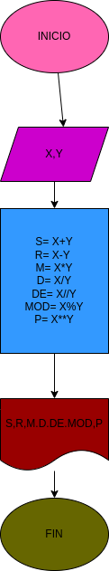

# Ejercicio No.3

## calcular la suma,resta,multiplicacion,division,division entera.modulo y potencia de X y Y

# ANALISIS

Variables de entrada (imput)

X: Primer valor de ingresar
Y: Segundo valor de ingresar

variable del proceso y salida (processing,storange,output)

s: suma
R: resta
M: multiplicacion
D: division
DE: division entera
MOD: modulo
P: potencia

# DISEÑO

# CONSTRUCCION